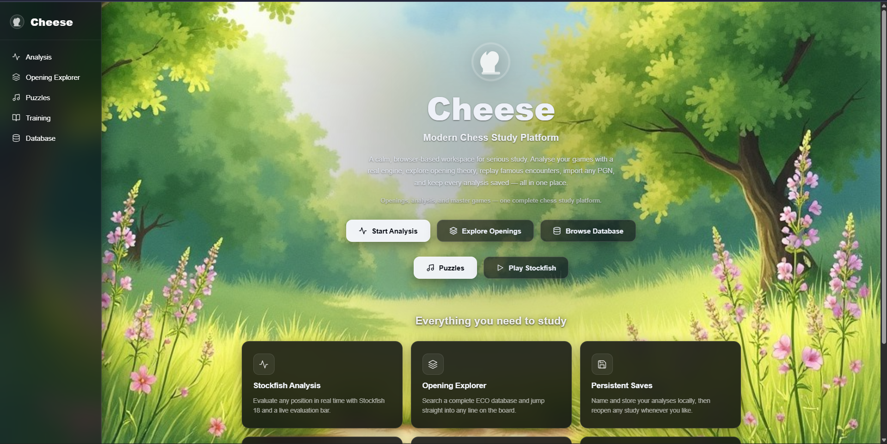
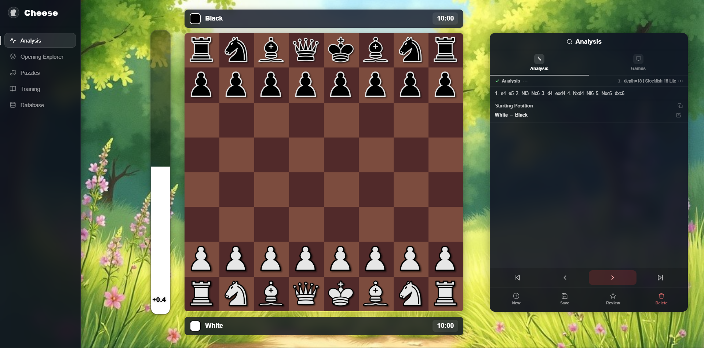
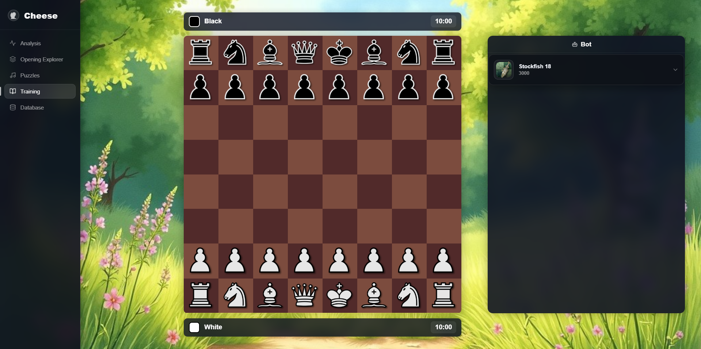

# Cheese

> A modern browser-based chess study platform.

**Live at [usecheese.xyz](https://usecheese.xyz)**

---

## Overview

**Cheese** is an all-in-one, desktop-focused chess study platform that runs entirely in the browser. It brings together everything you need to improve your game in one calm, cohesive workspace — analyse your games with a world-class engine, study openings, browse the greatest games ever played, and sharpen your skills against Stockfish.

There is no account to create and no server to configure. Cheese is a fast, fully client-side application: open it and start studying.

---

## Features

Everything below is available in **Version 1.2**.

| Feature | Description |
| --- | --- |
| **Stockfish 18 Analysis** | Analyse any position with the Stockfish 18 engine, including an evaluation bar and engine lines. |
| **Opening Explorer** | Browse openings by ECO code and hand off any line straight into Analysis. |
| **Play Against Stockfish** | Play full games versus the engine — choose your colour, with automatic board orientation and turn enforcement. |
| **Master Game Database** | Explore curated collections of games from legendary players, parsed dynamically from PGN. |
| **Local Save System** | Save your analyses locally in the browser and revisit them anytime. |
| **PGN Import** | Load games via PGN and review them move by move. |
| **Move Navigation** | Step forwards and backwards through any game with a clean move list. |
| **Modern Glassmorphism UI** | A consistent dark, glassmorphism-inspired interface across every page. |
| **Fast Client-Side Application** | No backend, no build step — everything runs instantly in the browser. |

---

## Upcoming Features

These are planned for future releases and are **not** part of Version 1.2:

- **Puzzle System** — tactical training with curated positions
- **Mobile Support** — a fully responsive experience for phones and tablets
- **More master games** — additional players and expanded collections
- **Additional improvements** — ongoing polish and quality-of-life updates

---

## Screenshots

_Screenshots will be added here._

**Home**

**Analysis**

**Database**

**Training**

---

## Technologies Used

| Technology | Role |
| --- | --- |
| **HTML5** | Page structure |
| **CSS3** | Styling, layout, and glassmorphism design |
| **JavaScript** | Application logic (vanilla, no framework) |
| **chess.js** | Move generation, legality, and game state |
| **Stockfish 18** | Chess engine (WebAssembly, runs in a Web Worker) |
| **PGN parsing** | Reading and splitting master games and imports |

---

## Design Philosophy

Cheese is built to be a **calm, distraction-free environment for studying chess**. The interface stays quiet and out of the way so the board and your analysis remain the focus, while a modern, consistent look keeps the whole experience cohesive from page to page. The goal is simple: a study platform that feels focused, polished, and pleasant to spend time in.

---

## Version

This README corresponds to **Version 1.2**.

---

## License

This project is licensed under the **GNU General Public License v3.0 (GPL-3.0)**.

You are free to use, study, share, and modify Cheese under the terms of the GPL-3.0. Any distributed derivative works must remain under the same license. See the [LICENSE](LICENSE) file for the full text.

---

## Thank You

Thanks for checking out **Cheese**! Your interest and feedback are genuinely appreciated. Enjoy your study, and happy analysing.